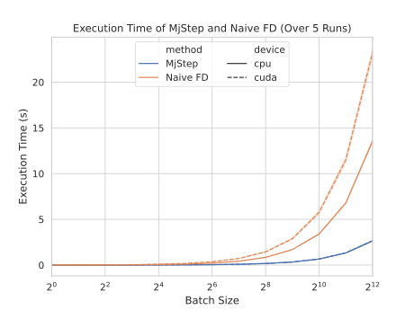

# DiffMjStep: Custom Autograd Extension for Differentiable MuJoCo Dynamics

[](https://opensource.org/licenses/MIT)

## Description

An efficient integration between PyTorch and MuJoCo. 
It enables automatic differentiation through MuJoCo simulation trajectories, 
allowing for gradient-based optimization of control policies directly within PyTorch. 

## Features

- **Efficient Gradient Computations**: Significantly more efficient than naive Jacobian finite differencing calculations as it utilizes the built-in finite difference method in MuJoCo [mjd_transitionFD](https://mujoco.readthedocs.io/en/stable/APIreference/APIfunctions.html#mjd-transitionfd).
- **Multi-Step Calculations**: Provides the ability to estimate gradients over multiple simulation steps, by propagating gradients through the entire trajectory.
- **Batch Simulation Support**: Enables batched simulations and gradient computations, significantly improving computational efficiency for large-scale experiments.

## Execution Benchmark


## Usage

```python
import torch
import mujoco as mj
from DiffMjStep import MjStep

# Initialize MuJoCo model and data
xml_path = 'path/to/your/model.xml'
mj_model = mj.MjModel.from_xml_path(filename=xml_path)
mj_data = mj.MjData(mj_model)

# Define initial state and control input tensors
state = torch.rand(mj_model.nq + mj_model.nv + mj_model.na, requires_grad=True)
ctrl = torch.rand(mj_model.nu, requires_grad=True)

# Compute next state and gradients
next_state, dydx, dydu = MjStep.apply(state, ctrl, n_steps=4, mj_model, mj_model, mj_data, compute_gradients=True)
```

## Citation

If you use this package in your research, we would appreciate citations to the following paper:

```
 @software{DiffMujStep2024,
  author = {Sharony, Elad},
  title = {{DiffMjStep: Custom Autograd Extension for Differentiable MuJoCo Dynamics}},
  year = {2024},
  version = {1.0},
  howpublished = {\url{https://github.com/EladSharony/DiffMjStep}},
}
```

## License

This project is licensed under the MIT License - see the LICENSE file for details.
