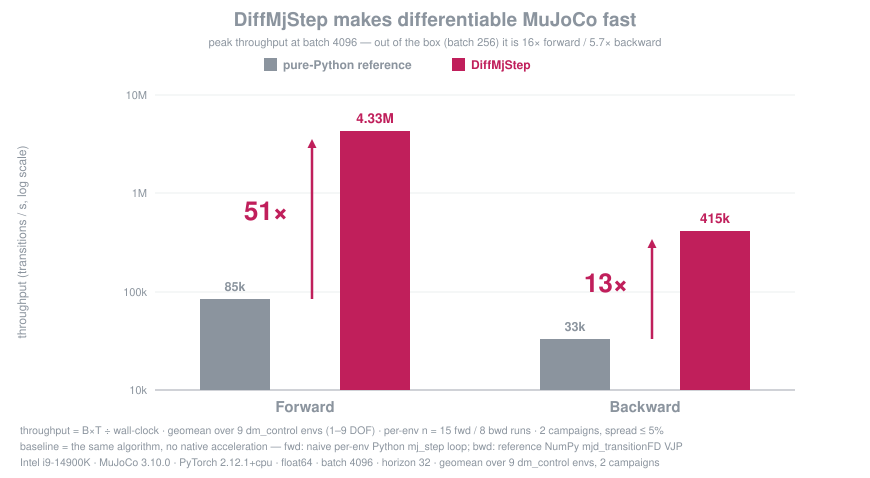
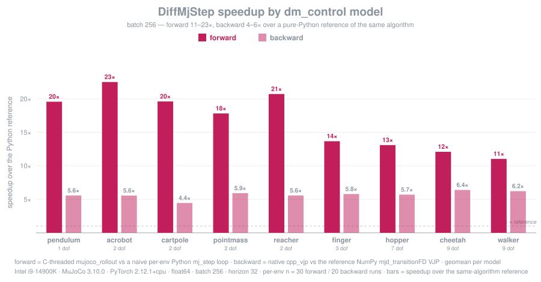

# DiffMjStep

**PyTorch autograd for MuJoCo rollouts on CPU.**

<p align="center">
  
</p>

**51× faster forward and 13× faster backward** than a pure-Python reference of the same
algorithm (batch 4096, CPU) — MuJoCo transition-FD gradients without leaving PyTorch.

The forward pass executes MuJoCo. The custom backward applies MuJoCo transition
Jacobians from `mjd_transitionFD` as a reverse-time VJP, so losses can differentiate with
respect to the initial state and control sequence without moving the simulation to another
framework.

```python
x1 = mj_step(model, x0, u)
loss = x1.square().sum()
loss.backward()  # x0.grad and u.grad
```

## Why it exists

- `loss.backward()` works through state, control, and optional sensor trajectories.
- `backend="auto"` uses MuJoCo's C rollout and the native threaded backward when available,
  with a clear Python fallback.
- The Python fallback and native path implement the same MuJoCo transition-FD VJP.
- The implementation stays small: Python orchestration plus one packaged C++ source file.

This is a finite-difference method. In contact-rich systems the result is a
**finite-difference estimate through nonsmooth contact dynamics**, so it can be noisy or
step-size-sensitive at discontinuities.

## Install

```bash
pip install .
```

The native extension targets Linux and macOS and needs a C++17 compiler plus `ninja`.

## Quickstart

```python
import mujoco
import torch

from diffmjstep import mj_step

xml = """
<mujoco model="pendulum">
  <option timestep="0.01" integrator="Euler"/>
  <worldbody>
    <body name="pole">
      <joint name="hinge" type="hinge" axis="0 1 0" damping="0.1"/>
      <geom type="capsule" fromto="0 0 0 0 0 -1" size="0.05" density="1"/>
    </body>
  </worldbody>
  <actuator><motor joint="hinge" gear="1"/></actuator>
</mujoco>
"""

model = mujoco.MjModel.from_xml_string(xml)
x0 = torch.tensor([[0.1, 0.0]], dtype=torch.float64, requires_grad=True)
u = torch.tensor([[0.2]], dtype=torch.float64, requires_grad=True)

x1 = mj_step(model, x0, u)
x1.square().sum().backward()
print(x1, x0.grad, u.grad)
```

Run the complete example with:

```bash
python examples/00_basic_step.py
```

The other examples cover trajectory optimization and sensor losses.

## Rollouts and linearization

`mj_rollout` accepts an initial state `x0` and controls `U` with shapes `[B, nx]` and
`[B, T, nu]`. With `return_all=True` it returns `[B, T+1, nx]`:

```python
from diffmjstep import mj_rollout

X = mj_rollout(model, x0, U)
X[:, -1].square().sum().backward()
```

For a single transition, including free-joint and quaternion models, use `mj_linearize`:

```python
from diffmjstep import mj_linearize

A, B = mj_linearize(model, x, u)
A, B, C, D = mj_linearize(model, x, u, sensors=True)
```

`mj_linearize` takes the full `[nq + nv + na]` state and returns `A`/`B` in MuJoCo's
`[2*nv + na]` tangent space. Autograd rollouts currently require `nq == nv`.

## Sensors

```python
X, Y = mj_rollout(model, x0, U, return_sensors=True)
sensor_loss = (Y[:, -1] - target).square().sum()
sensor_loss.backward()
```

Sensor timing follows MuJoCo's step contract: `Y[t] = g(x_t, u_t)`. Therefore
`Y[:, -1]` is the **last pre-step sensor**, not a reading at the terminal state `X[:, -1]`.
Losses may depend on `X`, `Y`, or both.

## Backends

- `auto` (default): C-threaded forward; native threaded backward when it loads, otherwise
  the Python MuJoCo transition-FD VJP.
- `mujoco_rollout`: C-threaded forward and Python backward.
- `cpp_vjp`: C-threaded forward and required native threaded backward.

The native code is packaged at
[`diffmjstep/cpp/rollout_vjp.cpp`](diffmjstep/cpp/rollout_vjp.cpp). `nthread` can override
the conservative automatic thread count.

## Validation and benchmarks

Speedup over a single-threaded pure-Python reference of the *same* algorithm, per dm_control
model, out of the box (batch 256): forward scales with simplicity (11–23×), backward is a
steady ~5–6×.

<p align="center">
  
</p>

Validation and benchmark tooling lives on the
[`revive/validation` branch](https://github.com/EladSharony/DiffMjStep/tree/revive/validation).

## Scope and limitations

- Autograd state and control inputs must be CPU `float32` or `float64` tensors on the same
  device.
- Autograd rollouts require `nq == nv`; `mj_linearize` supports free-joint and quaternion
  models in tangent space.
- RK4 is unsupported by `mjd_transitionFD`; use Euler, implicit, or implicitfast.
- Higher-order gradients are unsupported because the custom backward is
  `once_differentiable`.
- DiffMjStep disables MuJoCo solver warm-start on its private runtime model because the
  warm-start buffer is hidden state outside `x`. This keeps no-grad and autograd forward
  dynamics identical without mutating the caller's model.
  Model owners may pre-disable `mjDSBL_WARMSTART` for the zero-copy inference path.
- Pure callbacks whose outputs depend only on model, state, control, and simulation time are
  supported. For derivative calls, registrations must not change or be mutated concurrently
  from rollout forward through backward. An active Python
  callback uses the Python transition-FD path; behavior that depends on external mutable state
  is unsupported because finite-difference replay cannot reproduce it reliably.
- Plugin/history state that extends MuJoCo `FULLPHYSICS` snapshots is unsupported.
- Contact gradients remain a finite-difference estimate through nonsmooth contact dynamics.

## Citation

```bibtex
@software{DiffMjStep2026,
  author = {Sharony, Elad},
  title = {{DiffMjStep: PyTorch Autograd for MuJoCo Rollouts}},
  year = {2026},
  version = {0.2.0},
  howpublished = {\url{https://github.com/EladSharony/DiffMjStep}},
}
```
